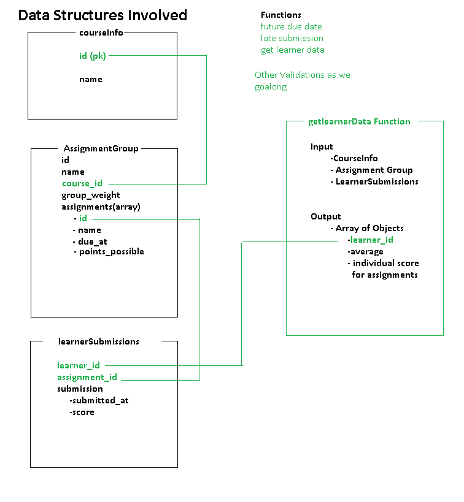

# SBA 308: JavaScript Fundamentals

## Introduction
This app facilitates the assessment of learners' understanding of fundamental JavaScript concepts and their ability to apply these concepts practically. The assessment encourages creativity in project development while emphasizing the demonstration of proficiency in specific topics. I have creatively completed this fundamental javascript project.

## Overview
- This app is designed to process learner submissions for assignments within the "Introduction to JavaScript" course. It calculates adjusted scores based on submission dates and due dates, and generates learner data including total scores, total possible points, and individual assignment scores.

## Important Notes
- Ensure that the provided data (CourseInfo, AssignmentGroup, and LearnerSubmissions) are correctly formatted and up-to-date.
- Pay attention to any error messages logged during execution, as they may indicate issues with data or processing logic.

## Usage 
-Any one can clone or for this git repo to learn different concepts like use of let and const, creating functions, using object to manupulate data and many more. 

## Initial plant for this project
